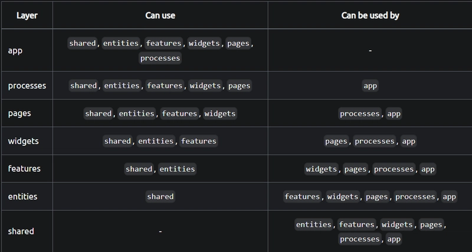

# Frontend Gitsearch

Projeto segue a metodologia **Feature-Sliced-Design(FSD)**

[Doc FSD](https://feature-sliced.design/docs/get-started/overview)

## Requisitos

* Node.js: v20.x
* Yarn v1.x (Classic)

## Arquitetura

Nomeação de pastas e arquivos em *kebab-case*

Cada Camada só pode importar de camadas inferiores!

* A Shared é a base, não pode importar de nenhuma outra camada
* Todos os componentes **PUROS** e **GENÉRICOS** ficam aqui.

## Tecnologias E Deps Core

* React + Typescript
* Vite
* Zustand: Gerenciamento de estado
* Styled Components: Estilização
* Ark ui: Biblioteca UI headless
* Axios: Client HTTP

## Contribuição

Todas ações desenvolvidas no projeto devem ter seu respectivo card no Trello.
Toda acão é uma nova branch `tipo/nr-task-trello/resumo`

* tipo: Prefixo utilizado nos conventional commits
* nr-task-trello: número do card do trello
* resumo: breve descrição da task

`feat/129/new-login-button`

---

Commits devem seguir o [Conventional Commits](https://www.conventionalcommits.org/en/v1.0.0/)

`test: add unit tests`
